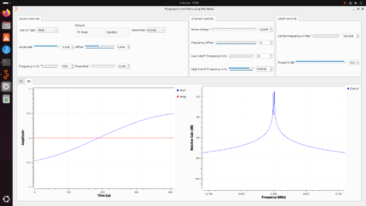

# **Práctica 2.** 
# **Modelo de canal**
## **Objetivos**
- ### Observar cómo el canal puede afectar la calidad de la señal transmitida y cómo mitigar sus efectos.
- ### Evaluar aspectos clave como la relación señal-ruido y la eficiencia en la transmisión de datos.
### Este enfoque permitirá no solo verificar la teoría, sino también desarrollar habilidades prácticas en el manejo de equipos de laboratorio, como equipos de medición (USRP 2920, osciloscopio R&S RTB2004 y analizador de espectros R&S FPC1000).
## **Materiales y Equipos**
- ### **USRP 2920:** Radio definido por software.
- ### **Osciloscopio R&S RTB2004:** Para visualización de señales en el dominio del tiempo y la frecuencia.
- ### **Analizador de Espectros R&S FPC1000:** Para mediciones en el dominio de la frecuencia.
- ### **Computador con GNU Radio:** Para simulación y generación de señales usando el USRP 2920.
- ### **Cables y conectores:** Para interconexión de equipos.
### -----
## **Actividad 1: Actividades de simulación de canal en GNU Radio**
### **Objetivo**
### Familiarizarse con algunos fenómenos de canal en un ambiente simulado.
### **Procedimiento**
### **Simulación**
- ### Verificar equipos y elementos a utilizar (revisar manuales de ser necesario)
- ### Cargar el flujograma:[filters_flowgraph.grc](https://github.com/omreyes/LabComUIS/blob/main/guides/practice2/filters_flowgraph.grc).
- https://github.com/omreyes/LabComUIS/blob/main/guides/practice2/filters\_flowgraph.grc
- ### Configurar siempre la frecuencia de muestreo (samp\_rate) en 25 e 6 / 2 n Hz`, donde n es un número entero mayor a 2.
DTERMINAR VALOR DE SAMP\_RATE:

n=5

Nota: Se descargó el .wav del github y se puso la ruta en el flujograma.

Referencia:

Caracterización del espectro en frecuencia y comportamiento en el tiempo de la señal transmitida TX y la señal filtrada RX para diferentes frecuencias de corte.

TX

RX 

|FMIN|FMAX|
| :- | :- |
|10Hz|0\.5MHz|

RX 

|FMIN|FMAX|
| :- | :- |
|0\.5MHZ|0\.9MHZ|

—-------------------

RX 

|FMIN|FMAX|
| :- | :- |
|10HZ|1KHZ|

—------

RX

|FMIN|FMAX|
| :- | :- |
|1KHZ|20KHZ|

—--------------------------------

TX

RX

|FMIN|FMAX|
| :- | :- |
|10HZ|900KHZ|

RX

|FMIN|FMAX|
| :- | :- |
|1020HZ|900KHZ|

RX

|FMIN|FMAX|
| :- | :- |
|1100HZ|900KHZ|

- ### Analice el efecto del ruido en el dominio del tiempo y la frecuencia para al menos dos formas de onda distintas.
  TX CON NOISE VOLTAGE EN EL CANAL

  

  RX

  |FMIN|FMAX|
  | :- | :- |
  |500HZ|1MHZ|

  

  RX

  |FMIN|FMAX|
  | :- | :- |
  |500HZ|1500HZ|

  

  TX TRIANGULAR

  

  RX CON RUIDO

  |FMIN|FMAX|
  | :- | :- |
  |10HZ|10000HZ|

  

  RX CON RUIDO

  |FMIN|FMAX|
  | :- | :- |
  |68KHZ|72KHZ|

  
- ### Muestre con un ejemplo gráfico el umbral de máximo de ruido ante el cual considera que es posible recuperar cada forma de onda utilizando únicamente filtrado.

TX

RX SIN RUIDO CON **9** ARMÓNICOS

![ref1]

RX SIN RUIDO CON **6** ARMÓNICOS

![ref1]

RX SIN RUIDO CON **2** ARMÓNICOS

RX SIN RUIDO CON **3** ARMÓNICOS

RX CON 3 ARMÓNICOS Y RUIDO

CONCLIUSIONES DE MODELADO DE CANAL Y FILTRADO:

Cuando una señal viaja a través de un canal con ruido, sufre degradaciones debido a interferencias, atenuación y dispersión. En estos casos, aplicar un filtrado adecuado que seleccione solo algunos armónicos de la señal original puede mejorar significativamente la recuperación de la información. La justificación de este enfoque se basa en varios principios clave:

Relación señal-ruido (SNR) mejorada:

Al filtrar solo los armónicos más significativos de la señal original, se puede reducir la cantidad de ruido introducido en el sistema. Si se intentara recuperar toda la señal incluyendo armónicos de muy baja potencia, la presencia del ruido podría dificultar la extracción de la información útil.

Propiedades de reconstrucción de Fourier:

En muchos sistemas de transmisión, las señales periódicas pueden representarse como una serie de Fourier. La reconstrucción de la señal no siempre requiere la totalidad de los armónicos, sino solo aquellos que contienen la mayor parte de la energía. Filtrando los armónicos con mayor potencia y descartando los de menor energía, es posible recuperar la señal con una fidelidad suficiente sin amplificar innecesariamente el ruido.

Criterio de relación señal-ruido mínima:

El criterio de que el último armónico seleccionado tenga al menos 20 dB más de potencia que el piso de ruido se fundamenta en la necesidad de garantizar que el ruido no enmascare la información contenida en los armónicos de menor amplitud.

20 dB representa una diferencia de potencia de 100 veces entre la señal y el ruido en escala lineal, lo que permite una detección confiable sin que el ruido interfiera de manera significativa.

Optimización del ancho de banda:

En sistemas de comunicaciones, el ancho de banda disponible es limitado. Filtrar los armónicos más relevantes permite aprovechar mejor los recursos espectrales y minimizar la interferencia de componentes innecesarios.

En conclusión, al filtrar selectivamente los armónicos más significativos de la señal y asegurar que el último armónico útil tenga al menos 20 dB de ventaja sobre el ruido de fondo, se logra una recepción más robusta, con menor distorsión y mejor relación señal-ruido. Esto permite la correcta recuperación de la información transmitida sin que el ruido degrade su calidad.

RESPONDIENDO A LAS PREGUNTA PROBLEMATIZADORAS:

Filtrar una señal implica modificar su contenido espectral, lo que puede afectar significativamente su forma y calidad. Si se eliminan las frecuencias altas, la señal resultante pierde componentes de rápida variación, volviéndose más suave y menos detallada. En aplicaciones de audio, esto se traduce en un sonido más opaco, mientras que en imágenes o vídeo provoca un efecto de desenfoque. Por otro lado, si el filtrado se realiza muy cerca de la frecuencia fundamental, la reconstrucción de la señal se ve comprometida, ya que los armónicos contribuyen a la fidelidad de la forma de onda original. La eliminación excesiva de estos componentes puede distorsionar la señal, dificultando su interpretación en sistemas de transmisión.

Cuando el filtrado afecta las frecuencias bajas, el resultado es la eliminación de la componente continua y las variaciones lentas, lo que puede ser útil para ciertos tipos de procesamiento pero también puede eliminar información clave en señales de baja frecuencia, como las de sistemas biomédicos o sensores de baja velocidad. De manera similar, la eliminación selectiva de armónicos modifica la estructura temporal de la señal, reduciendo su contenido espectral y afectando su reproducción. Este fenómeno es especialmente crítico en la transmisión de señales digitales, donde la supresión de armónicos puede degradar la correcta detección de los niveles lógicos.

Si la señal recibida experimenta desviación de frecuencia debido a variaciones en el canal de transmisión, un filtro mal diseñado puede atenuar componentes esenciales, reduciendo la inteligibilidad o la calidad del mensaje recibido. En estos casos, el filtrado puede ayudar a compensar los efectos no deseados, pero si no se ajusta adecuadamente, podría agravar la distorsión. Para cuantificar la degradación de la señal en presencia de ruido, se utilizan métricas como la relación señal a ruido (SNR) y el error cuadrático medio (MSE), las cuales permiten evaluar qué tan afectada está la información transmitida.

Mejorar la relación señal a ruido implica aplicar técnicas como el filtrado adaptativo, la amplificación selectiva de componentes relevantes o el uso de modulaciones más robustas. En señales analógicas, la calidad se puede evaluar mediante la relación señal a ruido y la distorsión armónica total, mientras que en señales digitales, métricas como la tasa de error de bit (BER) permiten cuantificar la fidelidad de la transmisión. Un análisis cuidadoso del contenido espectral y de los efectos del filtrado es clave para optimizar la recuperación de la señal y minimizar los efectos adversos del ruido y la distorsión en el proceso de comunicación.
## **Fenómenos de canal en el osciloscopio**
### **Objetivo**
### Familiarizarse con los fenómenos de un canal alámbrico real en el dominio del tiempo.
### **Procedimiento**
1. **Configurar el USRP 2920:**

   ----------------------------
   1. ### Configurar el flujograma[filters_flowgraph.grc](https://github.com/omreyes/LabComUIS/blob/main/guides/practice2/filters_flowgraph.grc) en GNU Radio para transmitir una señal a través del USRP.
   1. ### Habilitar o deshabilitar los bloques correspondientes (Channel Model, Throttle, UHD: USRP Sink, UHD: USRP Source, Virtual Sink). Para esto, seleccione el bloque deseado y presione **E** (enable) o **D** (disable), según corresponda.
   1. ### Configurar siempre la frecuencia de muestreo (samp\_rate) en 25 e 6 / 2 n Hz`, donde n es un número entero mayor a 2. Verifique que la frecuencia de muestreo durante la ejecución, sea la misma que ha configurado en el flujograma.
1. **Configurar el osciloscopio:**

   -------------------------------
   1. ### Encender, configurar y conectar el osciloscopio a la salida del USRP 2920 usando diferentes cables coaxiales, y ajustando los parámetros necesarios para evidenciar los fenómenos de canal analizados en la Actividad 1.
### **Preguntas Orientadoras**
- ### ¿Cuál es el efecto del ruido sobre la amplitud de las señales medidas en el osciloscopio? ¿Conservan las mismas relaciones que se evidencian en la simulación?
- ### ¿La relación señal a ruido creada intencionalmente en el computador se amplifica o se reduce en la señal observada en el osciloscopio?
- ### Demuestre ¿cómo se puede mejorar la relación señal a ruido en una señal?
- ### ¿Cómo se evidencia el fenómeno de desviación de frecuencia en el osciloscopio? Evidenciar al menos con dos formas de onda.
- ### Determine la afectación de un medio de transmisión coaxial (usar cables largos) sobre una señal periódica operando a las capacidades máximas de muestreo del USRP.
  - ### **NOTA:** La frecuencia de transmisión no debe superar los **500 MHz** para ser observada en el osciloscopio. Para el experimento, considere las relaciones de muestreo correspondientes.
- ### Usando cables coaxiales de diferentes longitudes, ¿cómo afecta la distancia entre el transmisor y el receptor a la amplitud de la señal medida?
- ### Usando antenas, ¿cómo afecta la distancia entre el transmisor y el receptor a la amplitud de la señal medida? ¿Es posible compensar el fenómeno?
- ### ¿Qué modelo de canal básico describe mejor las mediciones obtenidas en la práctica?
### **Evidencia**
TX

OSCILOSCOPIO

TX square

OSCILOSCOPIO 

tx cos

rx 

500mHZ CARRIER 

300mHZ CARRIER

50mHZ CARRIER 

Sen con ruido

osciloscopio 

square con ruido

osciloscopio 

freq offset 5khz

osciloscopio 

freq offset 10khz

Osciloscopio 

CONCLUSIONES DE FENOMENOS DE CANAL:

El ruido afecta la amplitud de las señales medidas en el osciloscopio al introducir fluctuaciones impredecibles que pueden distorsionar la forma de onda original, haciendo que los valores medidos difieran de los observados en simulaciones ideales. Aunque en un entorno simulado las relaciones entre amplitudes pueden mantenerse constantes, en la práctica, el ruido puede modificar estas relaciones al introducir variaciones aleatorias en la señal recibida. Además, la relación señal a ruido generada intencionalmente en un computador puede amplificarse o reducirse dependiendo de las características del sistema de adquisición y procesamiento de la señal. En el osciloscopio, si el ruido está presente en el canal de medición o si la señal es amplificada sin un adecuado filtrado, la SNR puede disminuir, haciendo que el ruido sea más prominente en la visualización.

Para mejorar la relación señal a ruido en una señal, se pueden emplear técnicas como el filtrado pasa-banda para eliminar componentes no deseadas, la amplificación de la señal útil antes de su transmisión y el promediado en el dominio temporal para reducir la variabilidad del ruido. En el osciloscopio, la desviación de frecuencia se evidencia cuando una señal modulada presenta cambios en su espectro a lo largo del tiempo, observándose como una variación en la periodicidad de la onda. Esto puede visualizarse con una señal de onda senoidal desplazada en frecuencia debido a inestabilidades en la portadora o en una señal modulada en frecuencia (FM) donde los ciclos se comprimen o expanden en función de la modulación aplicada.

El uso de un medio de transmisión coaxial introduce atenuación y dispersión en la señal, efectos que se acentúan con la longitud del cable y con la operación cercana a los límites de muestreo del USRP. A frecuencias elevadas, la impedancia del cable y las pérdidas por reflexión pueden degradar la señal, afectando su amplitud y distorsionando su forma de onda en el osciloscopio. Al emplear cables coaxiales de distintas longitudes, se observa que una mayor distancia entre el transmisor y el receptor reduce la amplitud de la señal debido a las pérdidas por atenuación, lo que también afecta la claridad de la forma de onda medida.

Cuando se utilizan antenas en lugar de cables, la distancia entre el transmisor y el receptor influye aún más en la amplitud de la señal debido a la dispersión y la absorción del entorno. La reducción de la amplitud con la distancia sigue típicamente una ley de inverso del cuadrado, aunque en ambientes con obstáculos pueden presentarse fenómenos de reflexión y difracción que alteran la propagación. Para compensar estas pérdidas, se pueden emplear antenas con mayor ganancia, aumentar la potencia de transmisión o usar técnicas de diversidad espacial. Finalmente, el modelo de canal más adecuado para describir las mediciones prácticas depende del entorno, pero en el caso de cables coaxiales, el modelo de línea de transmisión con pérdidas es el más representativo, mientras que para transmisiones inalámbricas, modelos como el de espacio libre o de múltiples trayectorias pueden describir mejor el comportamiento observado.
### -----
## **Actividad 3: Fenómenos de canal en el analizador de espectro**
### **Objetivo**
### Familiarizarse con los fenómenos de un canal alámbrico real en el dominio de la frecuencia.
### **Procedimiento**
1. **Configurar el USRP 2920:**

   ----------------------------
   1. ### Configurar el flujograma[filters_flowgraph.grc](https://github.com/omreyes/LabComUIS/blob/main/guides/practice2/filters_flowgraph.grc) en GNU Radio para transmitir una señal a través del USRP.
   1. ### Habilitar o deshabilitar los bloques correspondientes (Channel Model, Throttle, UHD: USRP Sink, UHD: USRP Source, Virtual Sink). Para esto, seleccione el bloque deseado y presione **E** (enable) o **D** (disable), respectivamente.
   1. ### Configurar siempre la frecuencia de muestreo (samp\_rate) en 25 e 6 / 2 n Hz`, donde n es un número entero mayor a 2. Verifique que la frecuencia de muestreo durante la ejecución, sea la misma que ha configurado en el flujograma.
1. **Configurar el Analizador de Espectros:**

   ------------------------------------------
   1. ### Encender, configurar y conectar el analizador de espectros a la salida del USRP 2920 usando diferentes cables coaxiales, y ajustando los parámetros necesarios para evidenciar los fenómenos de canal analizados en la Actividad 1.
### **Evidencia**

CONCLUSIONES FENOMENOS DE CANAL EN EL ANALIZADOR DE ESPECTROS

El ruido afecta la respuesta en frecuencia de las señales medidas en el analizador de espectro al introducir componentes espectrales no deseadas que pueden dificultar la identificación de las frecuencias presentes en la señal original. A diferencia de una simulación donde las relaciones entre los picos espectrales se mantienen estables, en la práctica, el ruido de fondo eleva el nivel de la base espectral, reduciendo la visibilidad de componentes de menor amplitud y alterando la precisión de la medición. La relación señal a ruido generada desde el computador puede amplificarse o reducirse dependiendo del tipo de amplificación o procesamiento aplicado antes de la transmisión. Si el sistema introduce ruido adicional o sufre pérdidas, la SNR observada en el analizador de espectro será menor que la esperada en la simulación.

Para evidenciar la medición de la relación señal a ruido, se pueden comparar dos formas de onda con diferentes niveles de potencia y ancho de banda. Una señal de tono puro mostrará una concentración de energía en una sola frecuencia con un piso de ruido más bajo, mientras que una señal modulada o de mayor ancho de banda presentará una distribución más amplia de energía, haciendo que la SNR se vea afectada. En el analizador de espectro, la desviación de frecuencia se manifiesta como un desplazamiento en el dominio de frecuencia, observable en señales moduladas en frecuencia (FM) o en señales con inestabilidad de oscilador, donde el espectro se desplaza o ensancha de manera perceptible.

Cuando se transmite una señal periódica a través de un medio coaxial de gran longitud y operando cerca de las capacidades máximas de muestreo del USRP, la atenuación y la dispersión afectan la respuesta en frecuencia. La señal sufre pérdidas crecientes a medida que la frecuencia aumenta, modificando su forma espectral y reduciendo la amplitud de los armónicos superiores. Usando cables coaxiales de diferentes longitudes, se observa que una mayor distancia entre el transmisor y el receptor disminuye la amplitud de la señal medida debido a la atenuación del medio y al aumento de las pérdidas resistivas.

En transmisiones inalámbricas con antenas, la distancia también impacta la amplitud de la señal medida, con una reducción proporcional al cuadrado de la distancia en un entorno sin obstáculos. Sin embargo, en condiciones reales, la propagación se ve afectada por reflexiones, difracción y absorción, lo que introduce fluctuaciones adicionales. Para compensar estas pérdidas, se pueden utilizar antenas con mayor ganancia, amplificadores de señal o técnicas de procesamiento digital como la ecualización adaptativa.

El modelo de canal que mejor describe las mediciones obtenidas en la práctica es aquel que considera tanto el ruido como la atenuación. Para medios cableados, un modelo de línea de transmisión con pérdidas y dispersión es el más adecuado, mientras que en enlaces inalámbricos, un modelo de canal de múltiples trayectorias con desvanecimiento y ruido térmico describe mejor los efectos observados en la señal medida.

[ref1]: Aspose.Words.bcc33ace-9245-4815-a0b6-bb3d9b9173f4.021.png
