# GNURADIO_LABCOMUIS_2025_1_E1B_G1
**PRÁCTICA 1C**

**Práctica 1C. Mediciones de potencia y frecuencia**

**Objetivo General**

Familiarizarse con el uso de herramientas de software definido por radio (SDR) como GNU Radio, junto con equipos de medición como el USRP 2920, el osciloscopio R&S RTB2004 y el analizador de espectros R&S FPC1000. Los estudiantes aprenderán a medir y analizar parámetros clave en comunicaciones, como potencia, ancho de banda, relación señal a ruido (SNR) y piso de ruido.

**Materiales y Equipos**

USRP 2920: Radio definido por software.

Osciloscopio R&S RTB2004: Para visualización de señales en el dominio del tiempo y frecuencia.

Analizador de Espectros R&S FPC1000: Para mediciones en el dominio de la frecuencia.

Computador con GNU Radio: Para simulación y generación de señales usando el USRP 2920.

Cables y conectores: Para interconexión de equipos.

**Actividad 1: Revisión de Especificaciones de los Equipos**

Objetivo

Familiarizarse con las especificaciones técnicas de los equipos de laboratorio y entender cómo configurarlos para realizar mediciones.

Procedimiento

Revisar Manuales y Verificar Equipos:

Revisar las especificaciones de los equipos de laboratorio (USRP 2920, Osciloscopio R&S RTB2004 y Analizador de Espectros R&S FPC1000).

Identificar las principales funciones y controles de los equipos.

Seleccionar Especificaciones Relevantes:

Seleccionar las 5 especificaciones que consideren más relevantes de cada equipo.

Configuración de los Equipos:

USRP 2920: Identificar el rango de frecuencia y ganancia configurable del radio. Para esto, conecte la alimentación y el cable de red al radio, y desde un terminal (Ctrl + Alt + T) ejecute el comando uhd\_usrp\_probe.

Osciloscopio R&S RTB2004: Identificar el ancho de banda máximo, resolución vertical y tipos de mediciones soportadas.

Analizador de Espectros R&S FPC1000: Identificar el rango de frecuencia, resolución y figura de ruido.

**Evidencia**

Lista con las 5 especificaciones más relevantes de cada equipo.

**USRP 2920**:

* Rango de frecuencia: 50 MHz a 2.2 GHz
* Ancho de banda de transmisión: hasta 20 MHz
* Potencia máxima de salida TX: +20 dBm
* Nivel máximo de entrada RX: -15 dBm
* Impedancia de puertos RF: 50 ohmios

**Información adicional**:

* **Rango de frecuencia**: 50 MHz a 2.2 GHz
* **Ganancia configurable**: 0 dB a 31.5 dB, en pasos de 0.5 dB

**Analizador de Espectros R&S FPC1000**:

* Rango de frecuencia: 5 kHz a 1 GHz (ampliable a 3 GHz)
* Ancho de banda de resolución (RBW): desde 1 Hz
* Pantalla: 10.1" WXGA (1366 × 768 píxeles)
* Preamplificador integrado
* Impedancia de entrada RF: 50 ohmios

Información adicional:

* **Rango de frecuencia**: 5 kHz a 1 GHz, ampliable a 3 GHz
* **Ancho de banda de resolución (RBW)**: ajustable desde 1 Hz hasta 3 MHz **figura de ruido**: aunque la figura de ruido específica no se proporciona en las fuentes disponibles, el analizador presenta un nivel de ruido equivalente en banda (DANL) de hasta –158 dBm/Hz a 1 GHz, lo que indica una alta sensibilidad para la detección de señales débiles.

**Osciloscopio UNI-T UTD2102CEX**:

* Ancho de banda: 100 MHz
* Número de canales: 2
* Tasa de muestreo en tiempo real: 1 GSa/s
* Impedancia de entrada: 1 MΩ en paralelo con 24 pF
* Tensión máxima de entrada: 400 V (pico)

Información adicional:

* **Ancho de banda máximo**: 300 MHz
* **Resolución vertical**: 10 bits
* **Tipos de mediciones soportadas**:
* Mediciones automáticas de parámetros como voltaje pico a pico, frecuencia, periodo, tiempo de subida y bajada
* Análisis de formas de onda
* Análisis de protocolos de comunicación serial
* Funciones matemáticas avanzadas
* Análisis espectral

**Medición de piso de ruido normalizado.**

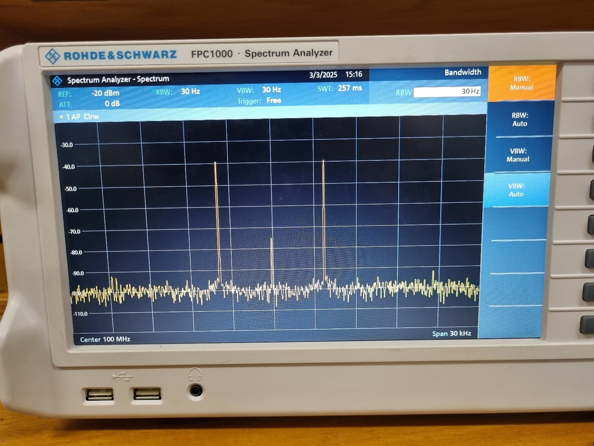

**El piso de ruido normalizado se calcula usando la ecuación:**

Piso de Ruido Normalizado = Potencia del ruido - 10log(RBW).

Sustituyendo los valores dados: -100 dB - 10log(30). Calculamos 10log(30), que es aproximadamente 14.77. Entonces, el piso de ruido normalizado es -100 - 14.77, lo que da aproximadamente **-114.8 dB.**

**Actividad 2: Simulación de Señales en GNU Radio**

Objetivo

Generar y analizar señales en GNU Radio para entender cómo se comportan diferentes formas de onda en tiempo y frecuencia.

**Análisis de Señales**

Analice y valide los resultados en el dominio del tiempo y de frecuencia si se modifica:

El tipo de dato de la fuente (compleja o flotante).

La forma de onda.

La frecuencia y fase de la señal.

La amplitud de la señal generada.

Modifique el nivel de ruido del modelo de canal y analice el efecto en tiempo y frecuencia.

**Evidencias**

Capturas de pantalla de señales generadas en el dominio del tiempo y la frecuencia que evidencien cada una de las comparaciones realizadas.

 **EL TIPO DE DATO DE LA FUENTE (COMPLEJA O FLOTANTE)** 

DATO DE LA FUENTE TIPO COMPLEJO   
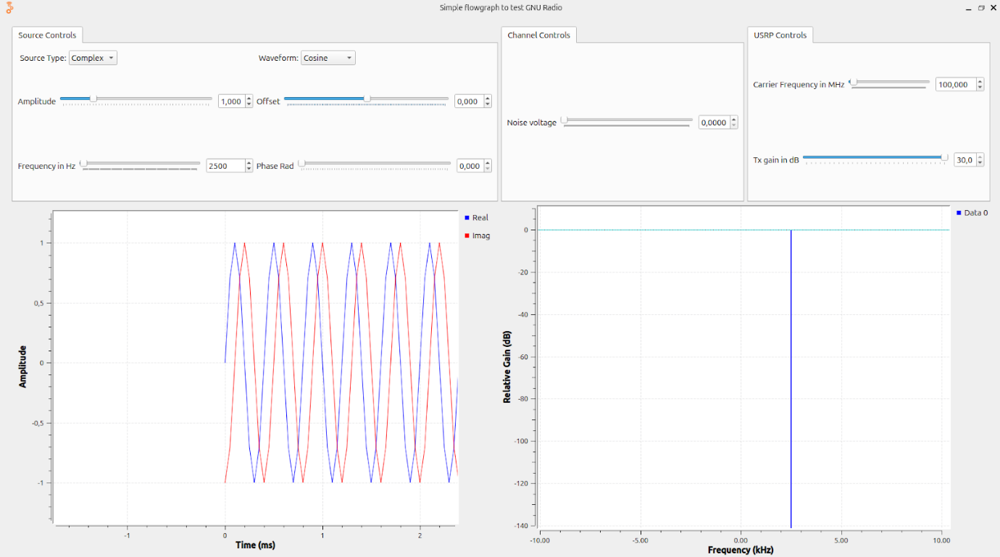
DATO DE LA FUENTE TIPO FLOTANTE 

 **LA FORMA DE ONDA** 
 FORMA DE ONDA DE SEÑAL TRIANGULAR (Amplitud: 1V; Frecuencia: 2.5kHz; sample rate ajustado a 20kHz    
 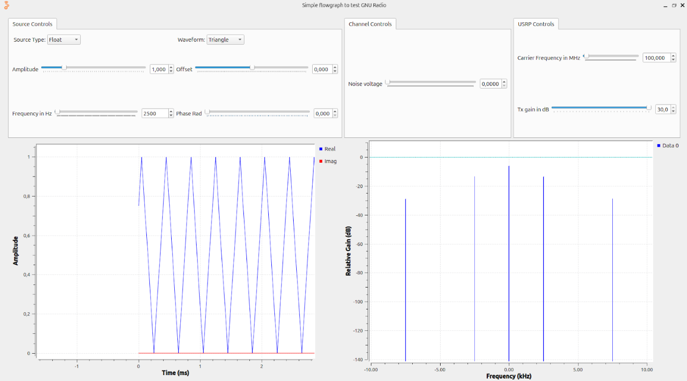
 FORMA DE ONDA DE SEÑAL COSENOIDAL (Amplitud: 1V; Frecuencia: 2.5kHz; sample rate ajustado a 20kHz 
 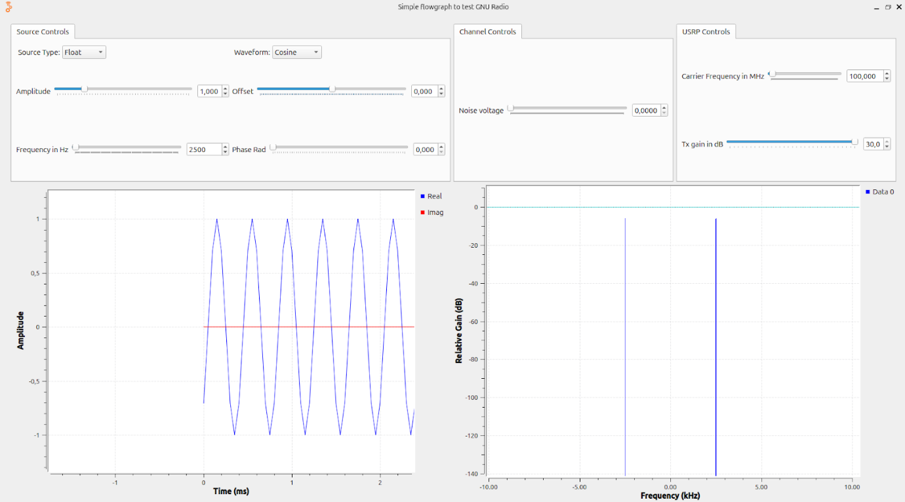
 **LA FRECUENCIA Y FASE DE LA SEÑAL** 
Señal cosenoidal compleja con frecuencia de 0.5kHz; Amplitud de 1V, sin offset, fase nula.    
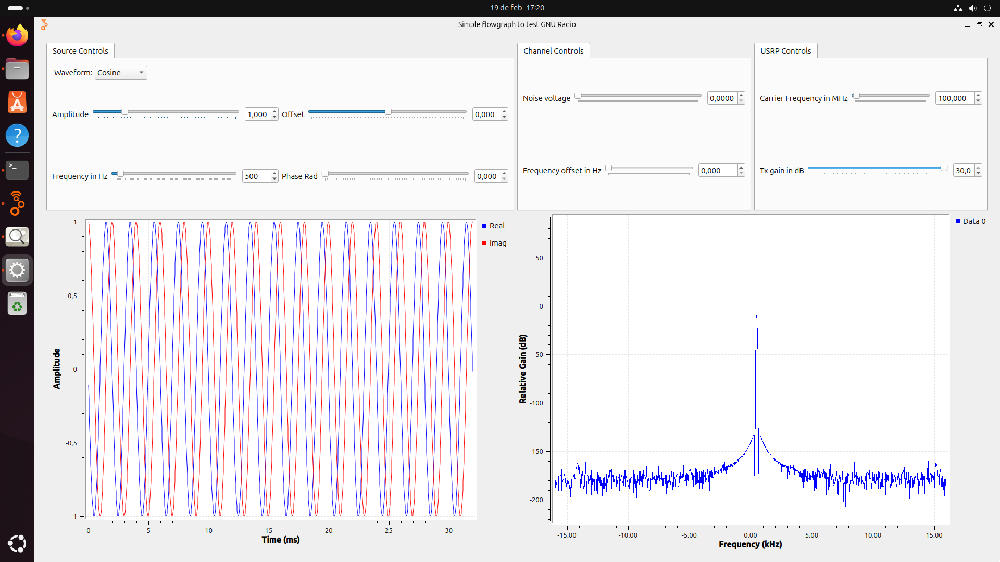
Señal cosenoidal compleja con frecuencia de 1kHz; Amplitud de 1V, sin offset, fase nula.    
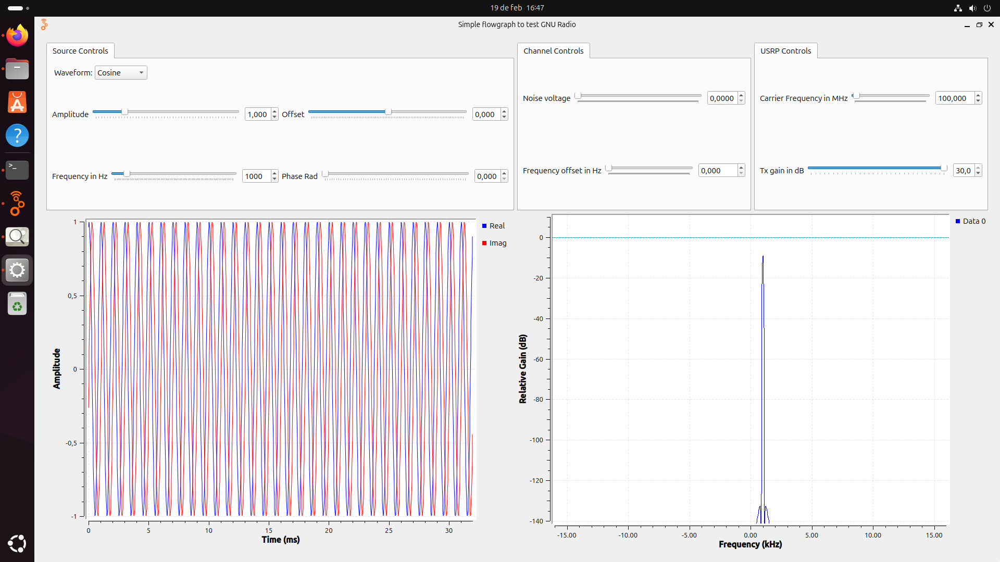
Señal cosenoidal compleja con frecuencia de 1kHz; Amplitud de 1V, sin offset, de 1 radian.    

Señal cosenoidal compleja con frecuencia de 1kHz; Amplitud de 1V, offset de 1V, fase de 2 radianes. 
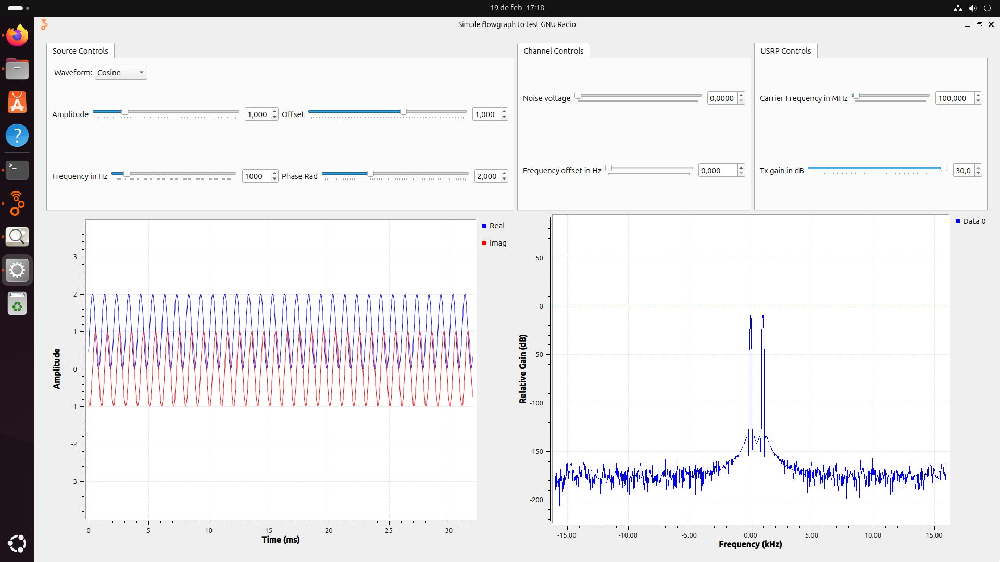
 **LA AMPLITUD DE LA SEÑAL GENERADA** 
 Señal cosenoidal compleja con frecuencia de 1kHz; Amplitud de 0.1V, offset nulo, fase nula.    
 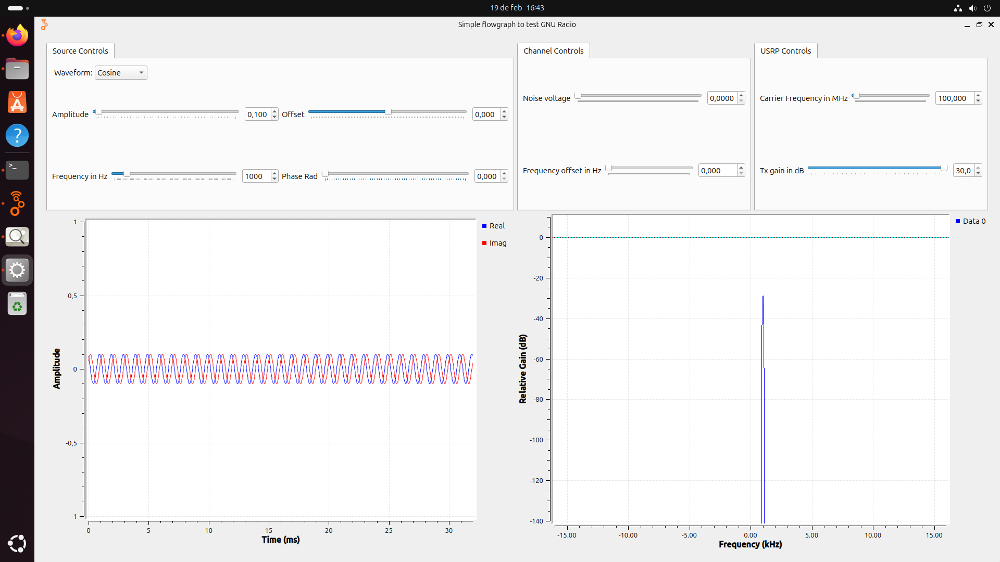
 Señal cosenoidal compleja con frecuencia de 1kHz; Amplitud de 1V, offset nulo, fase nula. 
 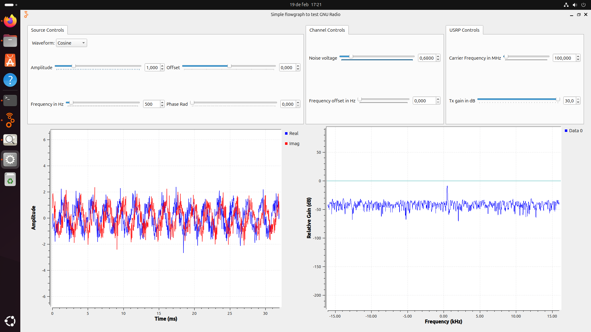
 NIVEL DE RUIDO DEL MODELO DE CANAL Y ANALICE EL EFECTO EN TIEMPO Y FRECUENCIA 
 Señal cosenoidal compleja con frecuencia de 0.5kHz; Amplitud de 1V, offset nulo, fase nula, ruido de voltaje de 0.68v. 

**Actividad 3: Transmisión y Medición de Señales con el USRP 2920**

Objetivo

Transmitir señales usando el USRP 2920 y medir parámetros clave como potencia, ancho de banda, piso de ruido y relación señal a ruido (SNR).

Procedimiento

Configurar el USRP 2920:

Configure el flujograma en GNU Radio para transmitir una señal a través del USRP. Habilite o deshabilite los bloques correspondientes (Channel Model, Throttle, UHD: USRP Sink, Virtual Sink). Para esto seleccione el bloque deseado y presionando E (enable) o D (disable), respectivamente.

Identifique el bloque de frecuencia de muestreo (samp\_rate) y observe el efecto de cambiar su valor (e.g. 10 kHz).

Configure la frecuencia de muestreo (samp\_rate) en 1 MHz.

Verifique el efecto de modificar la frecuencia y ganancia del USRP.

Medición con el Analizador de Espectros:

Conecte la salida del USRP al analizador de espectros.

Mida el piso de ruido normalizado a la frecuencia de portadora que va a utilizar.

Compare el espectro de la señal observada en el analizador de espectros con la observada en la pantalla de simulación. Tenga en cuenta que el radio (USRP) equivale al diagrama de bloques mostrado en la figura.

Evidencia

Capturas de pantalla de señales generadas en el dominio del tiempo y la frecuencia que evidencien las principales comparaciones realizadas.

Captura de la señal FM usada para medición de ancho de banda.

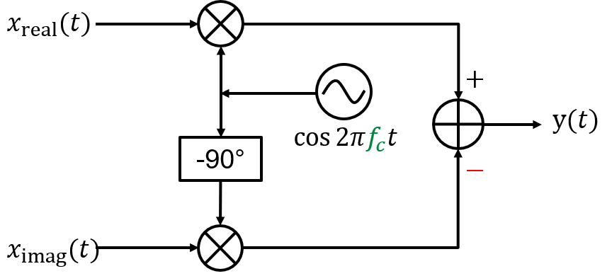

Analice y valide los resultados en el dominio de la frecuencia si se modifica:

El tipo de dato de la fuente (compleja o flotante).

La forma de onda.

La frecuencia y fase de la señal.

La amplitud de la señal generada.

Mida potencia de la señal transmitida y ancho de banda de diferentes señales generadas.

1. **Señal cuadrada (tipo flotante)**

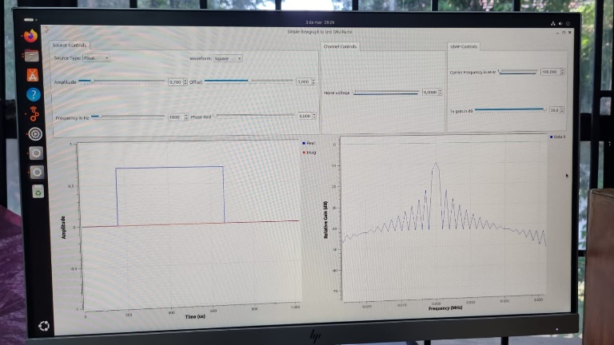

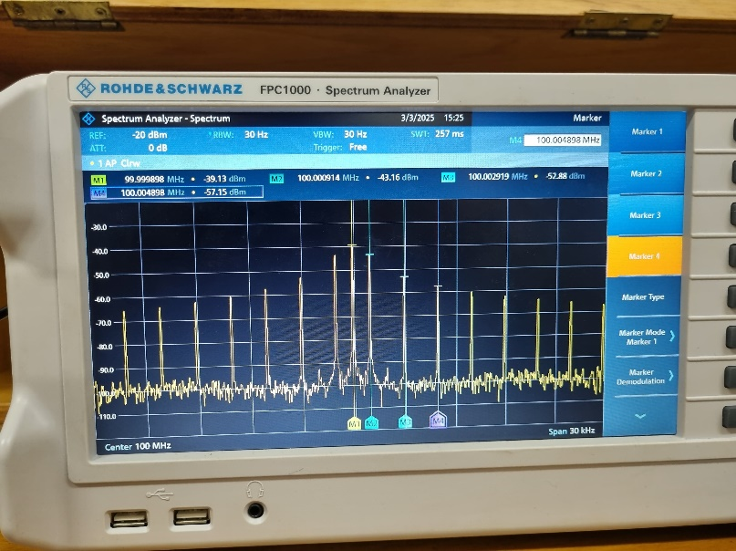

**SNR:**
SNR = Pseñal - Pruido = (−39.13 dBm)−(−100 dBm)=**60.87 dB**
Potencia señal transmitida:
**Pseñal =−39.13 dBm**

**Ancho de banda:**

***BW=10.279 kHz***

*2) señal cosenoidal (tipo complejo)*
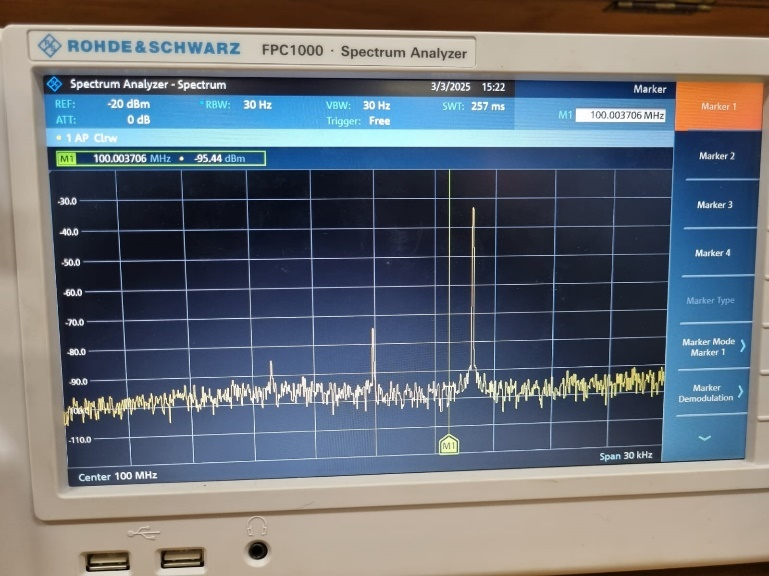

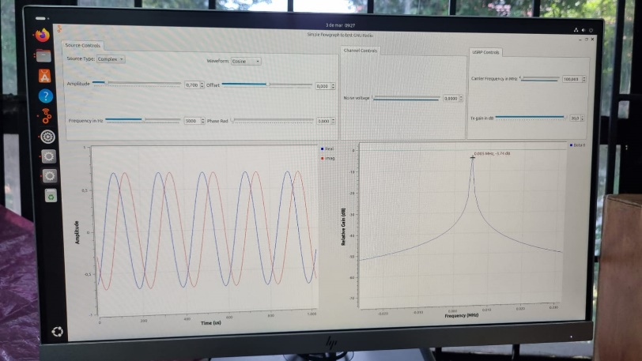
**SNR:**
SNR = Pseñal - Pruido = (−39 dBm)−(−100 dBm)= **61dB**
Potencia señal transmitida:
**Pseñal =−39 dBm**
**Ancho de banda:**

***BW=10 kHz***

*3) señal triangular (tipo flotante)*

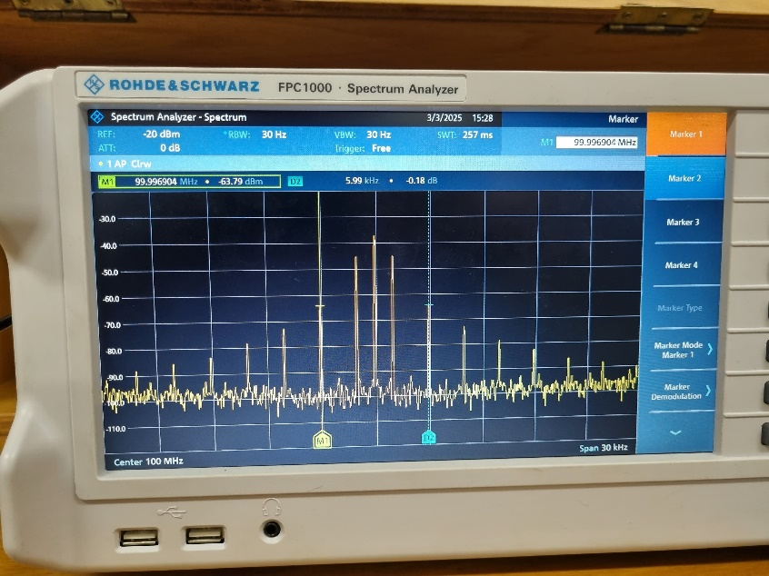

**SNR:**
SNR = Pseñal - Pruido = (−36.93 dBm)−(−99 dBm)=62.07 dB
Potencia señal transmitida:
Pseñal =−36.93 dBm
**Ancho de banda:**

***BW=5.99 kHz***

Conecte una antena apropiada a la entrada del analizador de espectros y observe el espectro de una señal FM (las estaciones FM se sitúan entre los 88 MHz y 108 MHz). Mida su ancho de banda y relación señal a ruido.

Determinar la máxima potencia de transmisión.

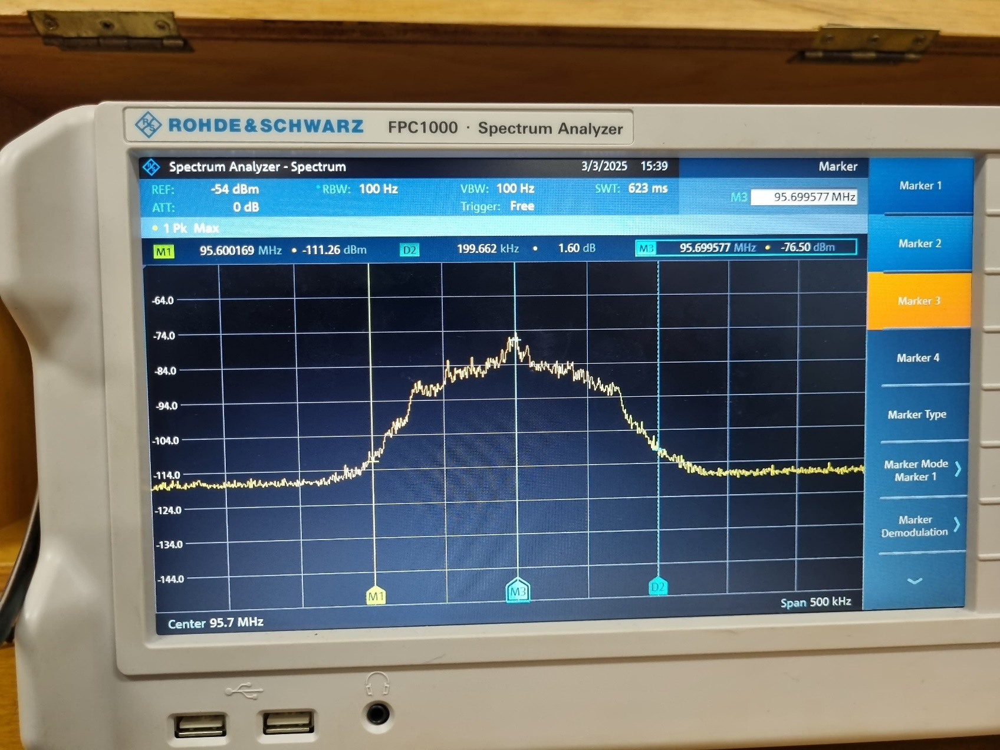

* Con ayuda de los markers que nos proporciona el analizador de espectros obtuvimos el ancho de banda y la potencia máxima transmitida:

**Ancho de banda:** 199.662 kHz (~200 kHz)

**SNR** = Pseñal – Pruido = (−76.50 dBm) − (−111.26 dBm) = 34.76 dB

**Máxima potencia de la señal FM medida:** **-76.50 dBm** (del marker 2)

1. **Medición con el Osciloscopio**:
   * Analice y valide los resultados en el dominio del tiempo si se modifica:
     + el tipo de dato de la fuente (compleja o flotante)
     + la forma de onda
     + la frecuencia y fase de la señal
     + la amplitud de la señal generada.

* Contraste estos resultados con los obtenidos con el analizador de espectros.

Amplitud 1; offset 0:

Onda cuadrada a 6.4 kHz
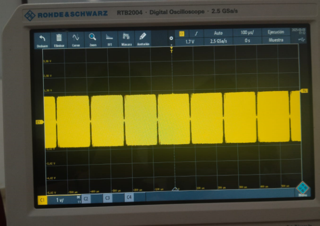
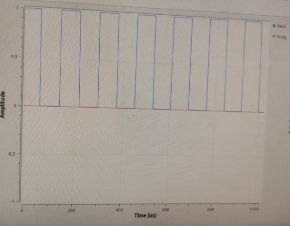

Onda triangular a 6.4 kHz
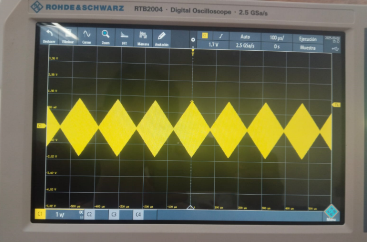
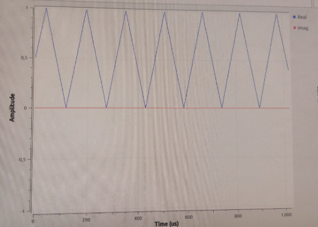

Onda triangular a 9.5 kHz
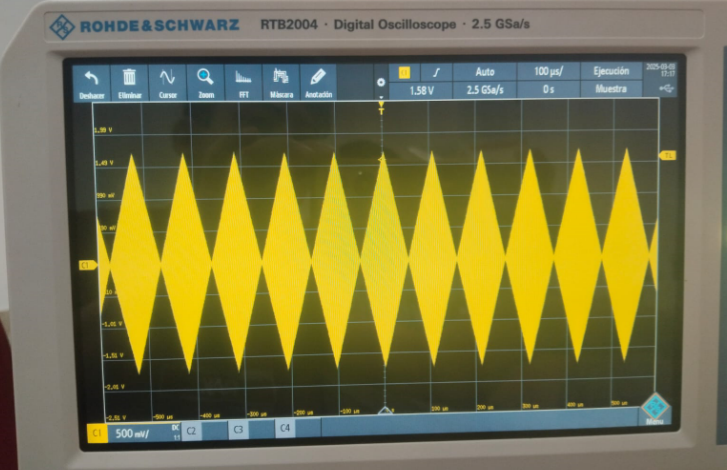
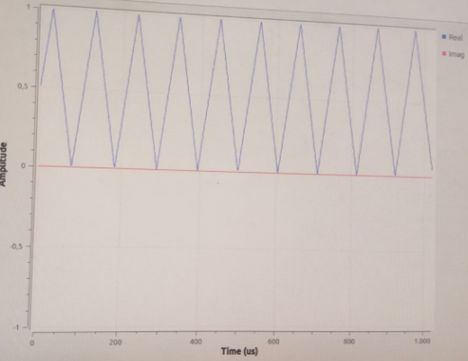

1. **Cálculo de la Relación Señal a Ruido (SNR)**:
   * Usar las mediciones de potencia y piso de ruido para calcular la SNR de algunas de las señales generadas.
   * Anotar el valor de la SNR en dB.

**Actividad 4: Análisis de Resultados y Conclusiones**

**Objetivo**

Analizar los resultados obtenidos y sacar conclusiones sobre el comportamiento de las señales en diferentes condiciones para elaborar el informe.

 **Comparación de Resultados** 

Los resultados obtenidos en las simulaciones y las transmisiones reales muestran diferencias significativas debido a la presencia de ruido y las limitaciones de los equipos de medición. En la simulación, las señales se generan en un entorno ideal sin interferencias externas, lo que permite observar formas de onda limpias y espectros bien definidos. Sin embargo, en las mediciones reales con el USRP 2920, se observa una degradación de la señal debido a la presencia de ruido, interferencias electromagnéticas y limitaciones en la ganancia y sensibilidad de los dispositivos.  En cuanto a las diferencias entre las mediciones realizadas con el osciloscopio y el analizador de espectros, se destaca que el osciloscopio permite visualizar la señal en el dominio del tiempo, facilitando el análisis de amplitud, fase (solo si se tiene una señal de referencia) y forma de onda. En cambio, el analizador de espectros proporciona información detallada sobre el contenido frecuencial de la señal, permitiendo la medición de parámetros clave como el ancho de banda, la potencia espectral y la relación señal a ruido (SNR), información que valida el concepto de series de Fourier y exponencial compleja. 

**Reflexión sobre la SNR** 

 La relación señal a ruido (SNR) es un parámetro fundamental en las comunicaciones inalámbricas, ya que determina la calidad y fiabilidad de la transmisión de datos. Una SNR elevada indica que la señal es claramente distinguible del ruido, lo que permite una mejor decodificación y menor tasa de errores en la recepción de información.  El piso de ruido tiene un impacto directo en la capacidad de detectar señales débiles. Un piso de ruido elevado reduce la sensibilidad del sistema, dificultando la recepción de señales de baja potencia. En nuestras mediciones, se observó que la SNR variaba según el tipo de señal y el entorno de medición, con valores máximos de aproximadamente 62 dB en señales triangulares y mínimos de 34.76 dB en transmisiones FM, donde el ruido de fondo es más notable. 
 
 **Conclusiones Finales** 
 
 A partir de los resultados obtenidos, se concluye que la precisión de las mediciones depende en gran medida del equipo utilizado y de las condiciones del entorno. Las simulaciones permiten un análisis preliminar de las señales en condiciones ideales, pero las mediciones en tiempo real reflejan los desafíos prácticos que pueden afectar la transmisión y recepción de señales, así como los efectos del canal en la degradación de la señal.  Las principales limitaciones de los equipos utilizados incluyen la sensibilidad del analizador de espectros y la resolución del osciloscopio, que pueden influir en la exactitud de las mediciones. Para mejorar la calidad de las mediciones, se podría considerar el uso de preamplificadores para reducir el impacto del piso de ruido, calculados en base a las especificaciones técnicas de los datasheets de los equipos, otra forma de mejorar las mediciones sería optimizar la calibración de los dispositivos de medición. Además, realizar pruebas en entornos controlados con menor interferencia ayudaría a obtener mediciones más precisas y representativas de las condiciones reales de operación.  A nivel de instrumentación se puede optimizar los rangos de frecuencia central y rango de espectro analizado con el fin de enfocarse en las componentes de mayor potencia que suelen ser las más significativas a la hora de analizar el espectro en frecuencia de una señal, la interpretación de los conceptos teóricos como exponencial compleja y series de Fourier se hacen vitales para validar lo que se está visualizando en el analizador de espectros. 
